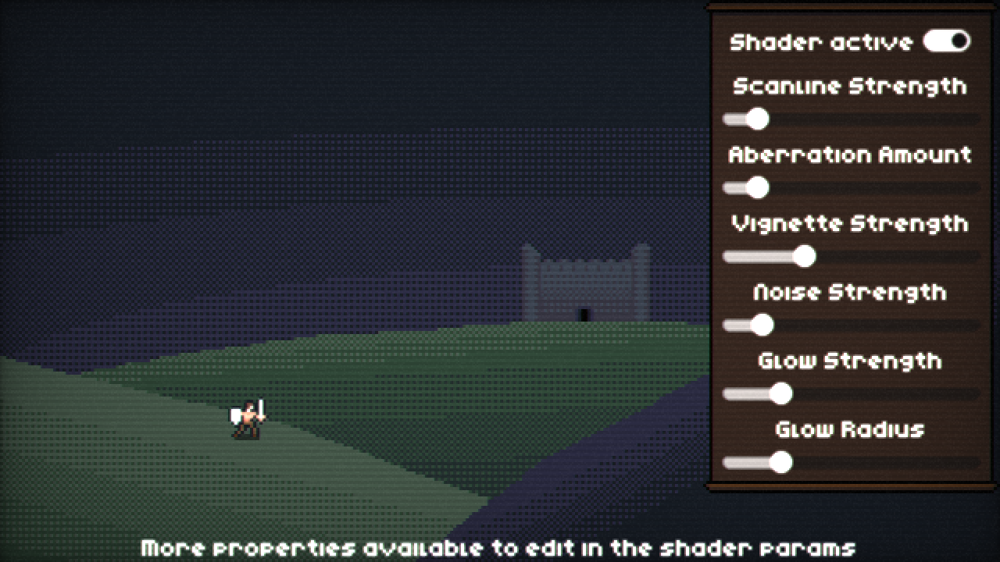

# Unto Deepest Depths Shader
This is the shader code used for [Unto Deepest Depths](https://store.steampowered.com/app/3106600/?utm_source=github), provided with a sample application so you can play around with the parameters. To use it in your own project:
- Add a CanvasLayer as an Autoload (assuming you want the effect applied globally, otherwise just add the CanvasLayer wherever desired in your application)
- Set the "Layer" property of the CanvasLayer to its max value so it draws on top of everything else
- Add a full screen ColorRect as a child of the CanvasLayer
- Add the shader to the ColorRect and adjust parameters accordingly

**Note:** Some UI items, such as tooltips, may draw on top of the CanvasLayer. If that's an issue for you, you can (as of Godot 4.2) programmatically set the CanvasLayer to a higher value until it covers everything properly.

## Other notes
The shader in this repository uses snippets from, and/or is influenced by, other quality open source retro shaders such as [VHS and CRT monitor effect](https://godotshaders.com/shader/vhs-and-crt-monitor-effect/) and [Realistic CRT shader](https://godotshaders.com/shader/realistic-crt-shader/).

If you want to know more about the development of the game, I have devlogs you [can read](https://shaggydev.com/2024/09/04/unto-deepest-depths-devlog/) [or watch](https://youtu.be/w6jXgaWHo1s).

This code is provided as-is, with no warranty.